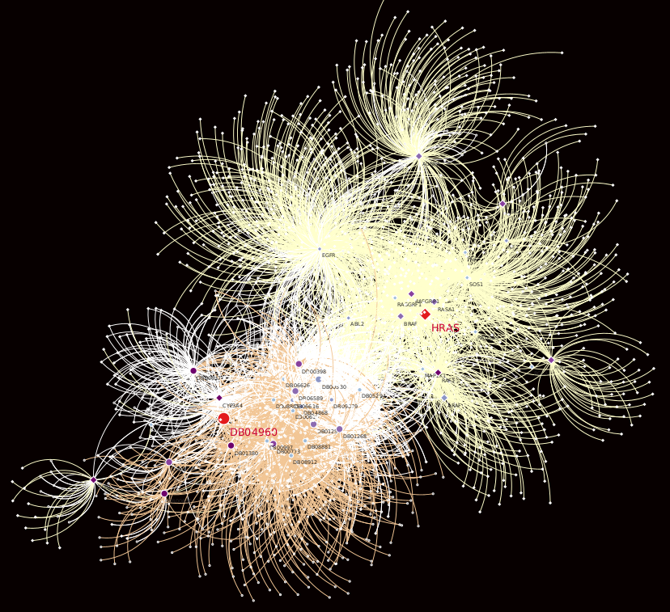

# Biological Applications of Random Walk with Restart on Multilayer Networks
Anthony Baptista, Galadriel Brière, Anaïs Baudot

## Node prioritization in Leukemia

<!--  -->


Run MultiXrank using the following command line:

```python ~/ApplicationsMultiXrank/Leukemia/script_bash.py``` 

Visualize top 20 proritized genes and drugs in Cytoscape with file: [Leukemia/multiXrank_results/cytoscape_net/top20.cys](Leukemia/multiXrank_results/cytoscape_net/top20.cys)

Or explore the network on your browser: [Leukemia/multiXrank_results/cytoscape_net/web_session](Leukemia/multiXrank_results/cytoscape_net/web_session/)

