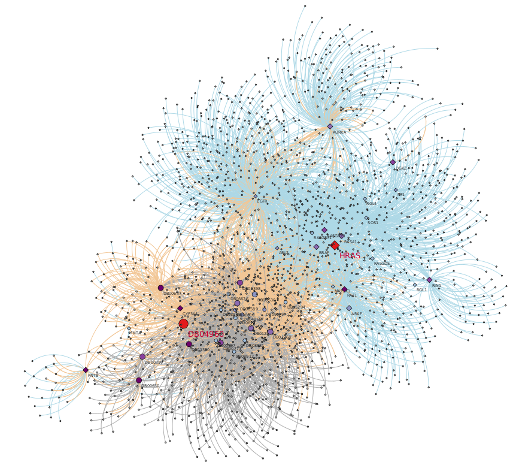
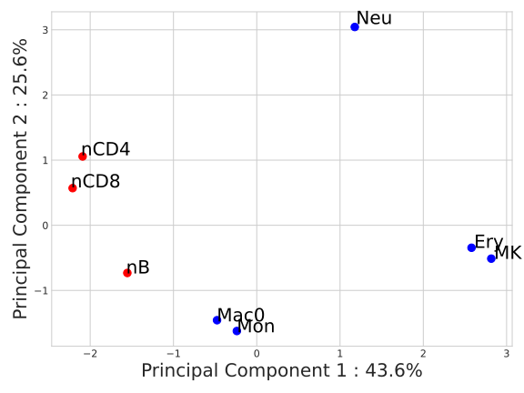

# Biological Applications of Random Walk with Restart on Multilayer Networks
Anthony Baptista, Galadriel Brière, Anaïs Baudot

## Node prioritization in Leukemia

Run MultiXrank using the following command line:

```python ~/ApplicationsMultiXrank/Leukemia/run_mxr.py``` 

Visualize top 20 proritized genes and drugs in Cytoscape with file: [Leukemia/multiXrank_results/top20_cyto.cys](Leukemia/multiXrank_results/top20_cyto.cys)

<div style="max-width:70%;"></div>

## Node prioritization in Epilepsy and Nicotine Dependence using the Hetionet network

Learn more about Hetionet:

+ [**Systematic integration of biomedical knowledge prioritizes drugs for repurposing**](https://doi.org/10.7554/eLife.26726)<br>
  Daniel S Himmelstein, Antoine Lizee, Christine Hessler, Leo Brueggeman, Sabrina L Chen, Dexter Hadley, Ari Green, Pouya Khankhanian, Sergio E Baranzini<br>
  _eLife_. 2017. DOI: 10.7554/eLife.26726

Run MultiXrank using the following commands:

##### 1 - Build Hetionet network

```python ~/ApplicationsMultiXrank/Hetionet/HetionetDB_to_MultiXrankDB/hetionet_to_multixrank.py``` 

##### 2 - Run MultiXrank

Epilepsy

```python ~/ApplicationsMultiXrank/Hetionet/Epilepsy/run_mxr.py``` 

Nicotine Dependence

```python ~/ApplicationsMultiXrank/Hetionet/NicotineDependence/run_mxr.py``` 


##### 3 - Run downstream analysis of MultiXrank scores

Epilepsy

```python ~/ApplicationsMultiXrank/Hetionet/Epilepsy/downstream_analysis/give_name.py``` 

```python ~/ApplicationsMultiXrank/Hetionet/Epilepsy/downstream_analysis/check_results.py```

```python ~/ApplicationsMultiXrank/Hetionet/Epilepsy/downstream_analysis/code_pie_tot.py``` 

Nicotine Dependence

```python ~/ApplicationsMultiXrank/Hetionet/NicotineDependence/downstream_analysis/give_name.py``` 

## Suppervised prediction of gene-disease associations

##### 1 - Create the training set
1914 positive G-D associations (from DisGeNET, v2.0, 2014) and 3828 negative G-D associations sampled randomly

```python ~/ApplicationsMultiXrank/GeneDiseaseAssociations/1_gene_disease_multiplexes/training_set.py``` 

##### 2 - Run MXR for all associations in the training set and store the results in sparse matrices

```python ~/ApplicationsMultiXrank/GeneDiseaseAssociations/1_gene_disease_multiplexes/generate_rwr.py```

```python ~/ApplicationsMultiXrank/GeneDiseaseAssociations/1_gene_disease_multiplexes/make_sparse_matrices.py```

##### 3 - Train classifiers

```python ~/ApplicationsMultiXrank/GeneDiseaseAssociations/1_gene_disease_multiplexes/train_models.py```

##### 4 - Compare DisGeNET v2.0 (2014) and DisGeNET v7.0 (2020) associations and generate the test set

```python ~/ApplicationsMultiXrank/GeneDiseaseAssociations/1_gene_disease_multiplexes/test_2020associations/compare_2014_2020_associations.py```

7218 positive G-D associations (from DisGeNET, v7.0, 2020) and 7218 negative G-D associations sampled randomly

```python ~/ApplicationsMultiXrank/GeneDiseaseAssociations/1_gene_disease_multiplexes/test_2020associations/make_test_set.py```

##### 5 - Predict 2020 associations from MXR scores

```python ~/ApplicationsMultiXrank/GeneDiseaseAssociations/1_gene_disease_multiplexes/test_2020associations/generate_rwr.py```

```python ~/ApplicationsMultiXrank/GeneDiseaseAssociations/1_gene_disease_multiplexes/test_2020associations/make_sparse_matrices.py```

```python ~/ApplicationsMultiXrank/GeneDiseaseAssociations/1_gene_disease_multiplexes/test_2020associations/predict_2020associations.py```

You can also run the pipeline for a 3 layer network containing a drug interaction layer by repeating the same steps in GeneDiseaseAssociations/2_gene_disease_drug_multiplexes.

## Diffusion Profiles in Hematopoietic Cells for Immune Disease Comparison 

##### 1 - Define seed immune diseases

```python ~/ApplicationsMultiXrank/Comorbidity/immune_diseases_set.py```

Going from the list of immune diseases contained in `autoimmune_disease.txt`, keep as seeds autoimmune diseases that appear in the disease layer `diseases_monoplex_no_self_loop.tsv`. Note that MultiXrank do not consider seeds that only present self-loops in the multiplex network. Hence, we only consider immune diseases that are connected to other diseases in the disease layer.

##### 2 - Run MultiXrank for each immune disease taken as seed and each of the hematopoietic cell-specific network

```python ~/ApplicationsMultiXrank/Comorbidity/run_MXR.py```

##### 3 - Recover the tree lineage of hematopoietic cells from MultiXrank output scores

<div style="max-width:70%;"></div>

```python ~/ApplicationsMultiXrank/Comorbidity/tree_lineage_analysis.py```

##### 3 - Analyse immune diseases based on MultiXrank output scores


<div style="max-width:70%;"></div>

```python ~/ApplicationsMultiXrank/Comorbidity/diseases_analysis.py```
